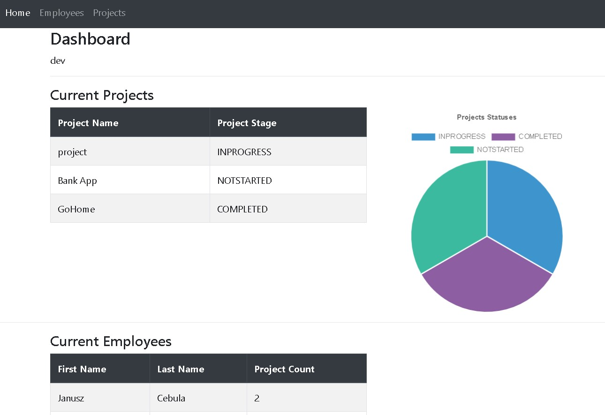

# Project Management App
> Simple web application for project and employee management.
> Live demo [_here_](https://www.example.com). <!-- If you have the project hosted somewhere, include the link here. -->

## Table of Contents
* [General Info](#general-information)
* [Screenshots](#screenshots)
* [Technologies Used](#technologies-used)

## General Information
After an unlogged user enters the main page of the project, weather conditions for his location are displayed. The location is determined based on the user's IP address. An unauthorized user can view the travel agency's offer. A user logged in as a customer may additionally sign up for a selected trip and add comments. A user logged in as an employee or admin can add, delete and edit travel offers.

## Screenshots

## Technologies Used
The project was made using the Java programming language, as well as using the Spring Boot and Spring Security frameworks.
The application connects to the MySQL database and saves the data using Hibernate.
The visual layer was made using Bootstrap and Thymeleaf libraries.

